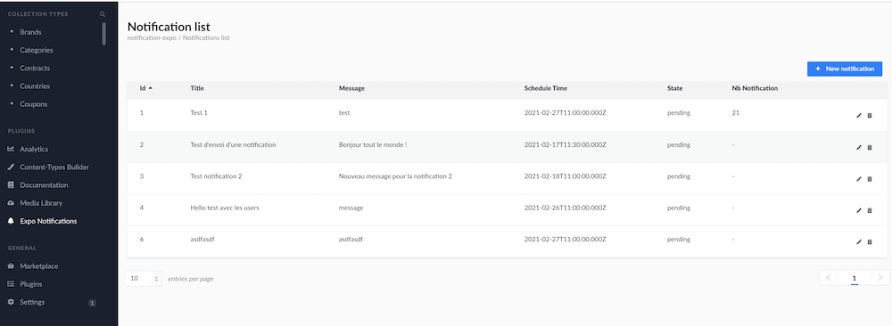
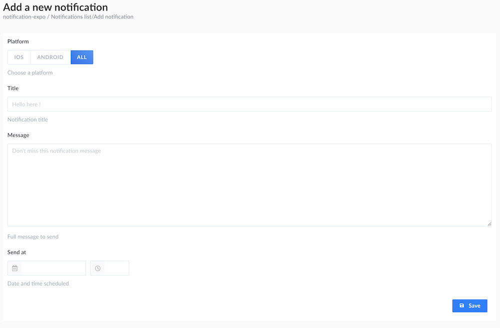

# strapi-plugin-notification-expo


**(Non-official)** Strapi plugins to send Expo notifications

This plugin allow you to draft & publish Expo notification

## Installation

### Requirements

* Strapi >= 3.4.*
* NodeJS >= 12.x <= 14
* NPM >= 6.x

### Install the package from your app root directory

- With `npm`
```shell
npm install strapi-plugin-notification-expo
```

- or `yarn`
```shell
yarn add strapi-plugin-notification-expo
```

### Database information

This plugin will add 2 tables into your project :
- `expotokens` : list of all Expo tokens (platform, "Expo push token", strapi `user`)
- `exponotifications`: list of all Notification with a state

### 🚀 Features

- Admin panel to manage notification
    - Build with [Buffetjs.io](https://www.buffetjs.io/)
    - Used `Draft and Publish` Strapi feature to send notification
    - Send notification to a group of users via the Admin panel
    - Automatic publish with a dedicated cron as middleware call `cronExpo`
    - Set notification `read-only` if the notification has been sent
- Send notification to one user programmatically (from API services/controllers)


## 🤖 Configuration

### 1. Enable cron - edit `config/server.js`

This project launch a Cron Task to check every 10 minutes if notification need to be send, so you need to enabled `cron` in `config/server.js` :

```json
    cron: {
      enabled: true,
    },
```

If you want disable cron task on staging or development environment, edit `config/env/development/server.js` and disabled `cron`.

### 2. Build and re-launch Strapi

```shell
strapi build --clean
strapi dev
```

### 3. Enjoy the administration panel

- List of all notifications (with pagination)

  

- Add / edit notification


# 👾 Route, controllers, services 

## Add expo tokens

Method `POST` - `/notification-expo/expotokens`
```js
{
  token,     // ExponentPushToken[XXXaaaBBBCCCdddEEEfff]
  platform   // 'ios' | 'android'
}
```

## Send expo notification from an existing service to specific users 

Put this code anywhere in API controllers / services
```javascript
const notification = {
    user: ctx.state.user.id, // id of the user, for this example I used id of the current connected user
    title: '👍 Good job', // Notification title
    body: 'You are awesome', // Message display in the notification
    data: { 
      // additionnal data, JSON formatted, put what you need (their data are managed after into your Expo application)
      // I use often the "url" data, when use click on the notification, this is open the good screen into the app
      url: 'https://github.com/Lith/strapi-plugin-notification-expo',
    }
  };
await strapi.plugins['notification-expo'].services.expo.send(ctx, notification);
```


        
# ❓ FAQ

## How to register `expo token` from your Expo App to Strapi ?

In your app, add some code to register the token linked to the user account on Strapi API :

```typescript
Permissions
            .askAsync(Permissions.NOTIFICATIONS)
            .then(({status}) => {
                if (status === 'granted') {
                    return Notifications.getExpoPushTokenAsync();
                }
                return Promise.reject();
            })
            .then((token) => {
                return api
                    .post('/notification-expo/expotokens', {
                        token,
                        platform: Platform.OS
                    })
                    .catch((err) => {
                        if (err && err.statusCode === 409) {
                            return Promise.resolve();
                        } else {
                            return Promise.reject(err);
                        }
                    })
                    .then(() => dispatch(registerNotificationsTokenSuccess(
                        Notifications.addListener((notification) => {
                            dispatch(notify(notification))
                        })
                    )))
            })
            .catch((err) => dispatch(registerNotificationsTokenFail(err)))
```

# 🚧 Roadmap

* [ ] Manage `data` JSON object to send additional data into the notification
* [ ] Manage redirect URL onclick on the notification
* [ ] Save anonymous expo token
* [ ] Remove a draft notification
* [ ] Duplicate an existing notification
* [ ] Change the status of a notification (when an error occurs)
* [ ] Schedule circle notification (sent every hour/day/week/month)
* [ ] Add Tests with Cypress

# 🌟 Resources

## License 

* [MIT License](LICENSE)

## Links

- [Strapi website](http://strapi.io/)
- [Strapi forum](https://forum.strapi.io/c/packages/10) - ping @Lith
- [Strapi community on Discord](https://discord.strapi.io) - ping @Lith 
- [Strapi news on Twitter](https://twitter.com/strapijs)

## Support

- [Discord](http://discord.strapi.io) (Highly recommended for faster support - ping @Lith)
- [GitHub](https://github.com/Lith/strapi-plugin-notification-expo) (Bug reports, contributions)
